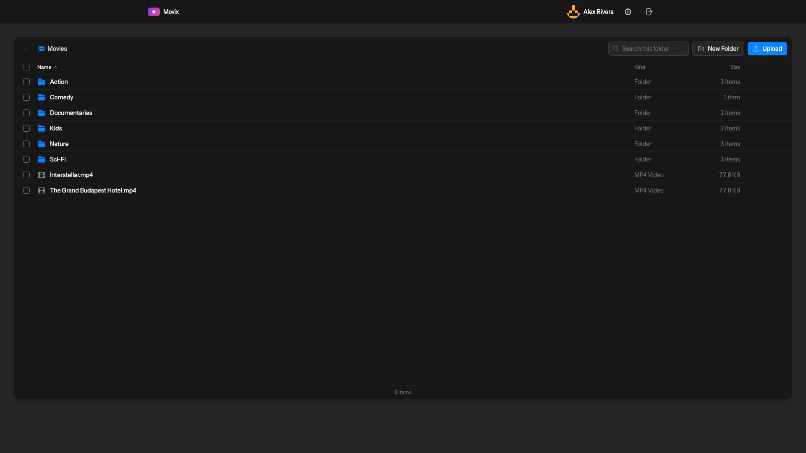
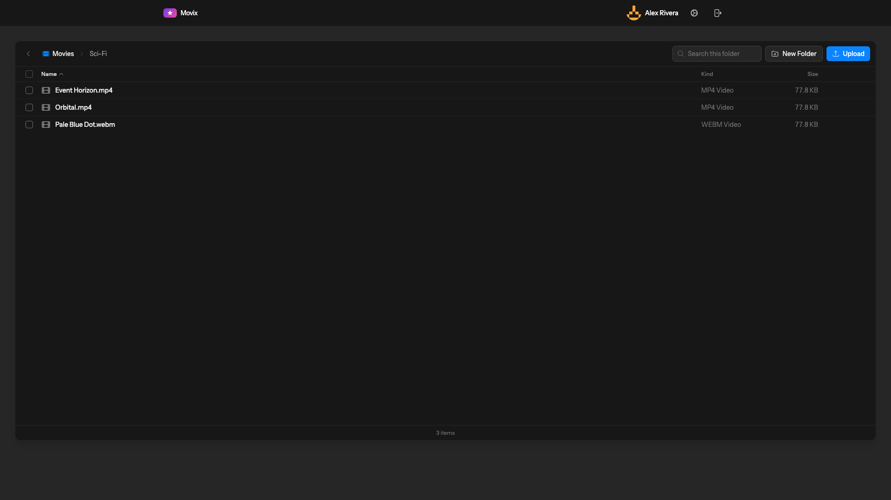
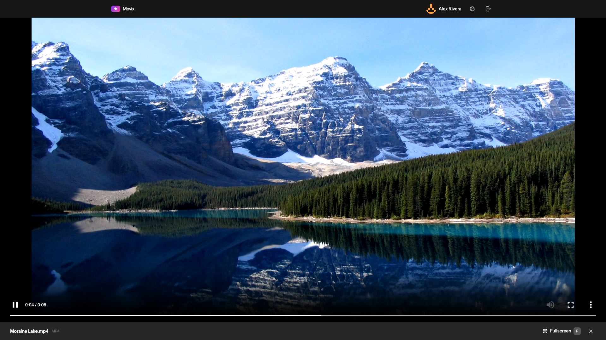
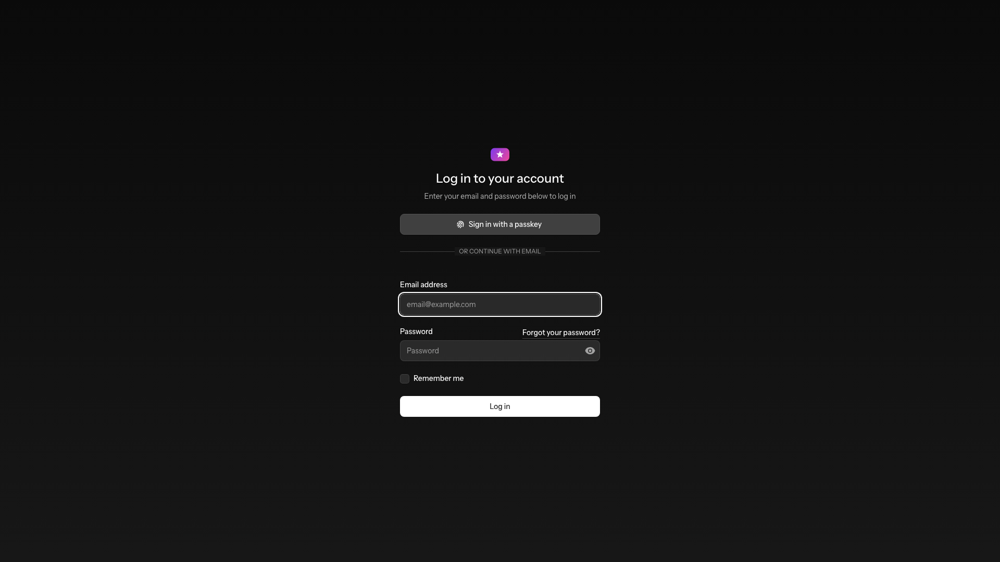

<p align="center">
  
</p>

<h1 align="center">Movix</h1>

<p align="center">
  A self-hosted movie library and streaming server — browse your video collection like a file manager and play it right in the browser.
</p>

<p align="center">
  
  
  
  
  
</p>

<p align="center">
  
</p>

---

## What is Movix?

Movix turns a folder of video files into a private, browsable streaming library. Point it at your movies, sign in, and watch — no transcoding pipeline, no external services, no accounts leaving your machine. It streams files straight from disk with full HTTP range support, so seeking and resume-where-you-left-off just work.

Built on the Laravel Livewire stack with a Finder-style interface, secured by passwordless passkeys and two-factor authentication.

## Features

- **📁 Finder-style browser** — Navigate nested folders with breadcrumbs, sort by name, kind, or size, and filter the current folder with instant search.
- **▶️ In-browser player** — HTML5 playback with HTTP range streaming for smooth seeking, edge-to-edge stage, fullscreen (press <kbd>F</kbd>), and keyboard controls.
- **⏱️ Resume playback** — Your position in every video is remembered client-side and restored automatically — even after an accidental page refresh.
- **⬆️ Uploads & file management** — Upload videos, create folders, rename, move, and delete — individually or in batches with multi-select.
- **🎞️ Multiple formats** — Plays `MP4`, `WebM`, `OGG`, and `MOV` files.
- **🔐 Modern authentication** — Passwordless **passkeys** (WebAuthn), **two-factor** auth (TOTP + recovery codes), password reset, and email verification, powered by [Laravel Fortify](https://laravel.com/docs/fortify).
- **🎨 Light, dark & system themes** — Appearance follows your OS or your explicit choice.
- **🛡️ Safe by design** — Path-traversal guards on every file operation and a private storage disk that is never publicly served.

## Screenshots

| Library | Inside a folder |
| :-----: | :-------------: |
|  |  |

| Player | Sign in |
| :----: | :-----: |
|  |  |

## Tech stack

| Layer      | Technology                                             |
| ---------- | ------------------------------------------------------ |
| Framework  | [Laravel 13](https://laravel.com)                      |
| Frontend   | [Livewire 4](https://livewire.laravel.com) + [Flux UI](https://fluxui.dev) + [Alpine.js](https://alpinejs.dev) |
| Styling    | [Tailwind CSS 4](https://tailwindcss.com)              |
| Auth       | [Laravel Fortify](https://laravel.com/docs/fortify) with passkeys & 2FA |
| Database   | SQLite (default)                                       |
| Build      | [Vite](https://vitejs.dev)                             |
| Testing    | [Pest 4](https://pestphp.com) + Larastan               |

## Requirements

- PHP **8.5**
- Composer
- Node.js & npm

## Installation

```bash
git clone <your-repo-url> movix
cd movix

# Install PHP & JS dependencies, set up .env, key, database, and build assets
composer setup
```

`composer setup` runs `composer install`, copies `.env`, generates the app key, migrates the database, and builds the frontend in one step.

Create your first account:

```bash
php artisan user:create
```

Then start the dev server:

```bash
composer dev
```

This runs the app server, queue worker, log viewer, and Vite together. Visit the site (e.g. `https://movix.test` with [Laravel Herd](https://herd.laravel.com), or `http://localhost:8000`).

## Adding movies

Drop your video files into the movies storage directory, or upload them from the UI:

```
storage/app/movies/
├── Action/
│   └── Midnight Run.mp4
├── Sci-Fi/
│   └── Event Horizon.mp4
└── Interstellar.mp4
```

Movix reads from the dedicated `movies` filesystem disk (configured in `config/filesystems.php`). Folders you create in the app map directly to directories here, so you can organize your library either way.

## Testing

```bash
# Run the full suite (formatting, static analysis, tests)
composer test

# Just the tests, compact output
php artisan test --compact
```

## License

Movix is open-sourced software licensed under the [MIT license](LICENSE).
